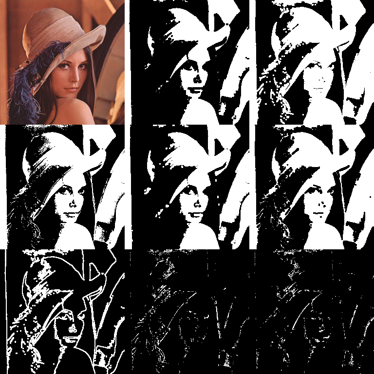
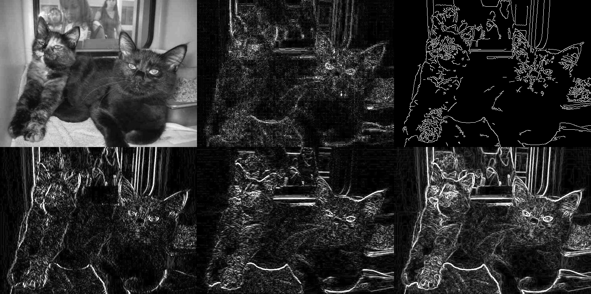
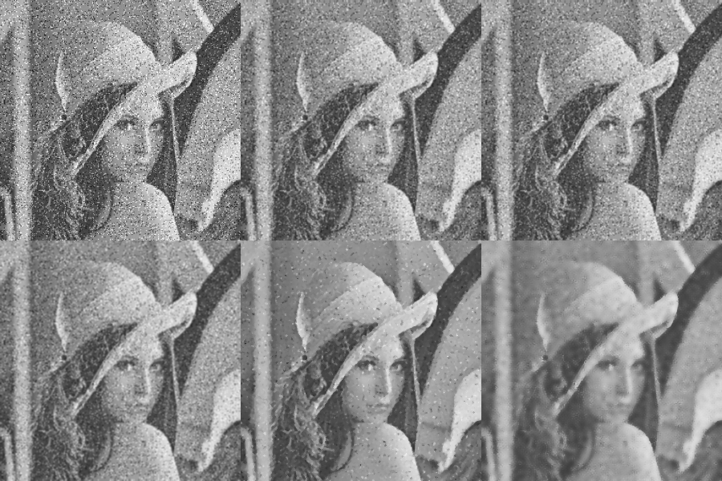

# Robotic Vision

This repository contains my experiments and projects in robotic vision, image processing, and computer vision using Python, OpenCV, NumPy, and MATLAB.

The work includes practical implementations of vision algorithms, robotic perception concepts, camera geometry, image analysis, and robotics-related visual processing workflows.

## Technologies Used

* Python
* OpenCV
* NumPy
* MATLAB
* Robotics Toolbox (RTB)
* Spatial Math Toolbox

## Areas Explored

* Image filtering and smoothing
* Edge detection
* Thresholding
* Morphological operations
* Masking and segmentation
* Background removal

## MATLAB Dependencies

Some MATLAB experiments require:

* Robotics Toolbox (RTB)
* Spatial Math Toolbox for MATLAB

## Sample Outputs

Download:
https://petercorke.com/toolboxes/robotics-toolbox/
